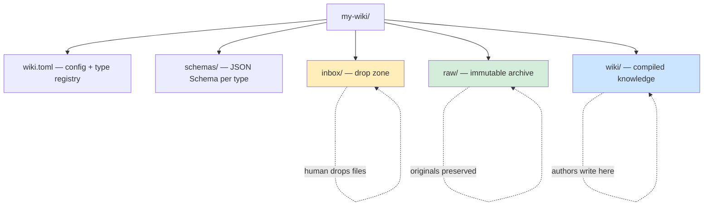
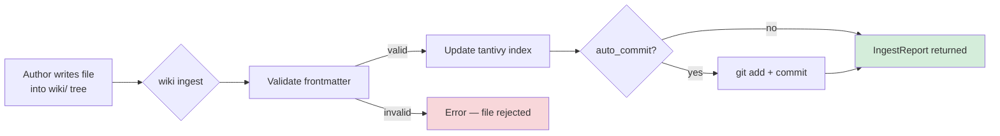
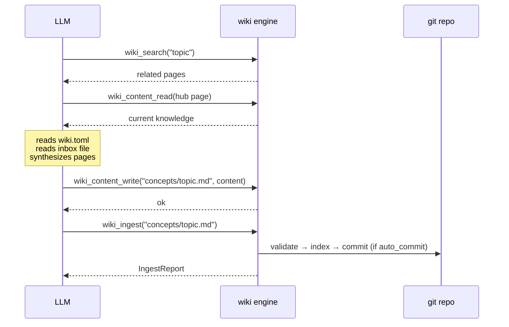
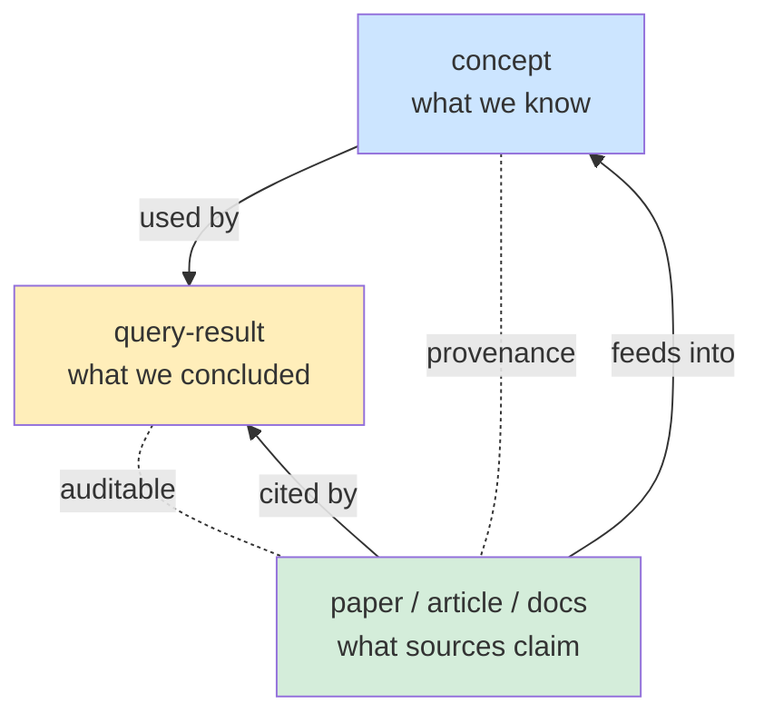
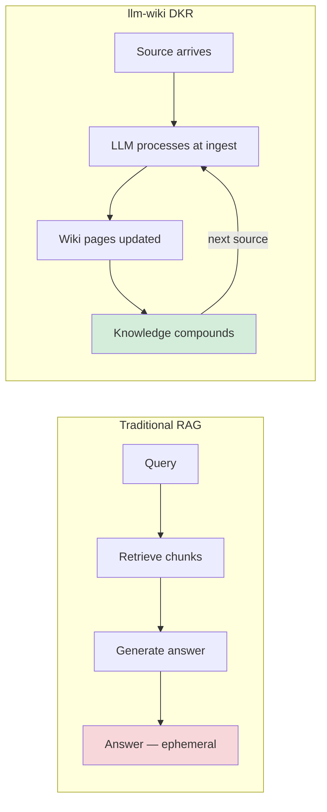
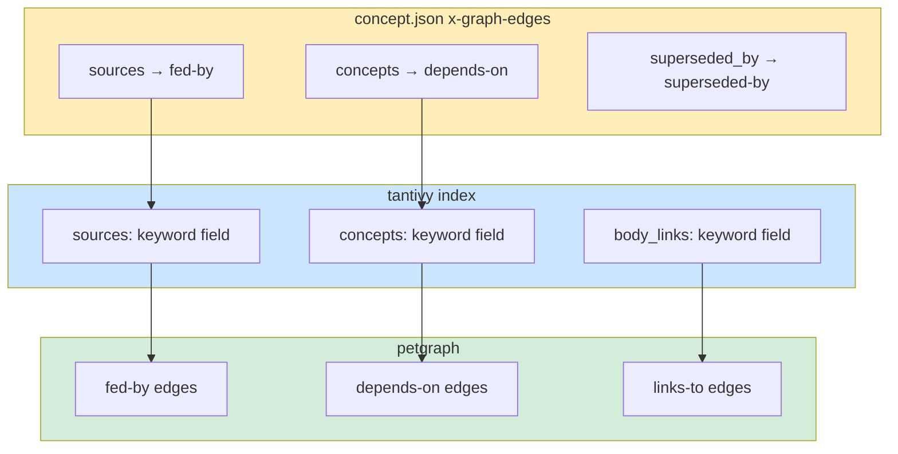
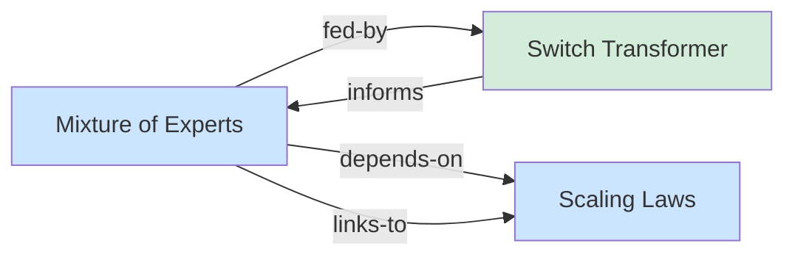
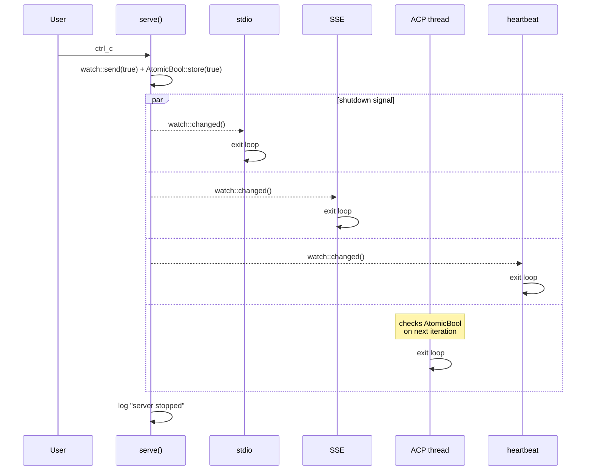
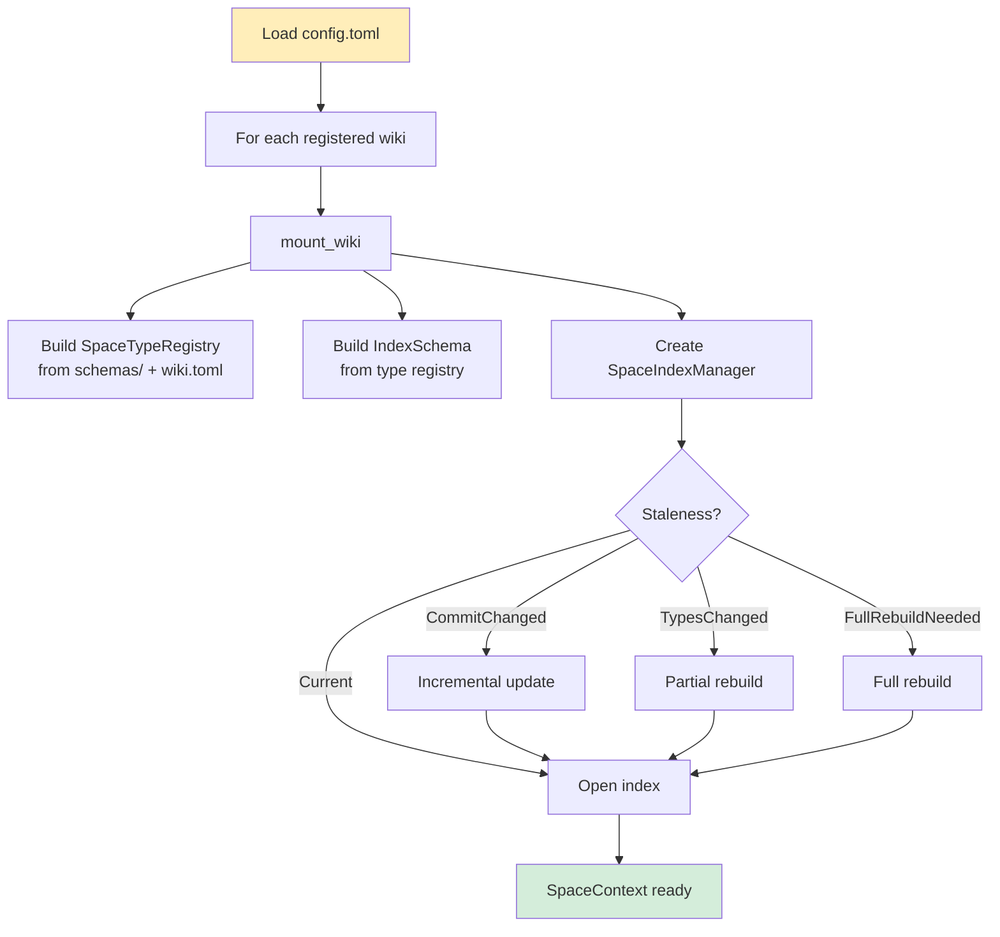

# Diagrams

Mermaid sources for llm-wiki diagrams.

## 1. Architecture Overview

How the engine sits between humans, LLMs, and the wiki repository.

References:
- [overview.md](overview.md)
- [server.md](specifications/engine/server.md)

## 2. Repository Layers

The structure of a wiki repository.

References:
- [wiki-repository-layout.md](specifications/model/wiki-repository-layout.md)
- [wiki-toml.md](specifications/model/wiki-toml.md)

## 3. Ingest Pipeline

How content enters the wiki.

References:
- [ingest-pipeline.md](specifications/engine/ingest-pipeline.md)

## 4. LLM Ingest Workflow

The full LLM-driven ingest loop via MCP tools.

References:
- [ingest-pipeline.md](specifications/engine/ingest-pipeline.md)
- [content-operations.md](specifications/tools/content-operations.md)

## 5. Epistemic Model

The three epistemic roles and how they relate.

References:
- [epistemic-model.md](specifications/model/epistemic-model.md)

## 6. RAG vs DKR

Side-by-side comparison of the two approaches.

References:
- [overview.md](overview.md)

## 7. Typed Graph Edges

How `x-graph-edges` declarations produce labeled edges in the concept
graph.

References:
- [graph.md](specifications/engine/graph.md)
- [type-system.md](specifications/model/type-system.md)

## 8. Graph Example

A concept page with sources and body links.

References:
- [graph.md](specifications/tools/graph.md)

## 9. Shutdown Flow

Coordinated shutdown across all transports.

References:
- [server.md](specifications/engine/server.md)
- [decisions/graceful-shutdown.md](decisions/graceful-shutdown.md)

## 10. Engine Startup

How `WikiEngine::build` mounts wikis.

References:
- [engine.md](implementation/engine.md)
- [index-management.md](specifications/engine/index-management.md)
