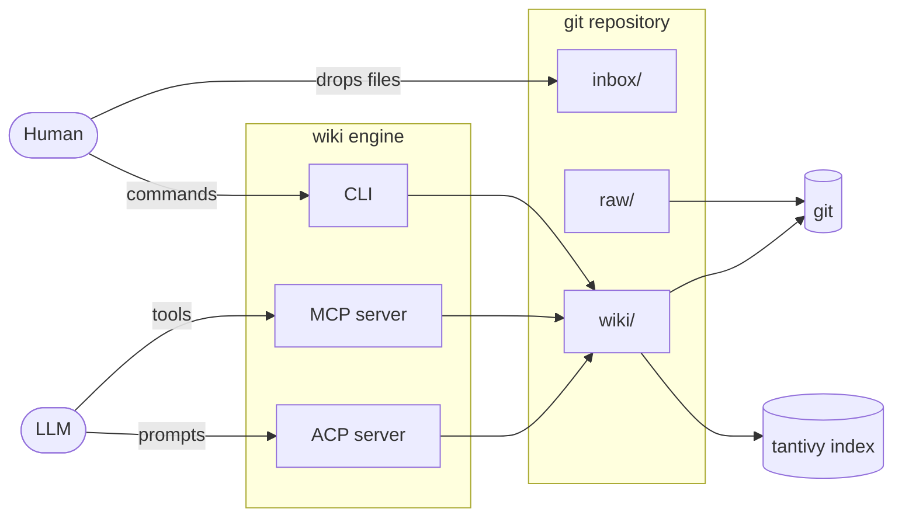
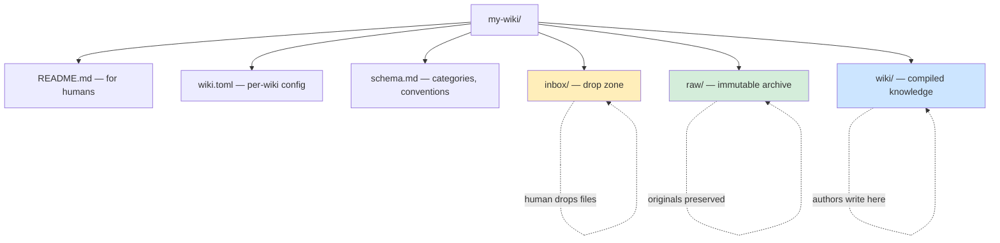
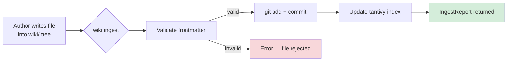
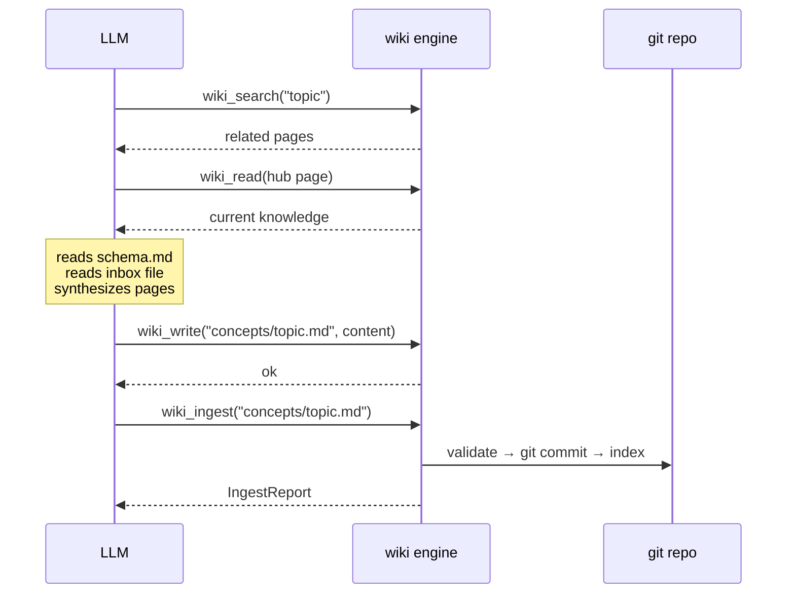
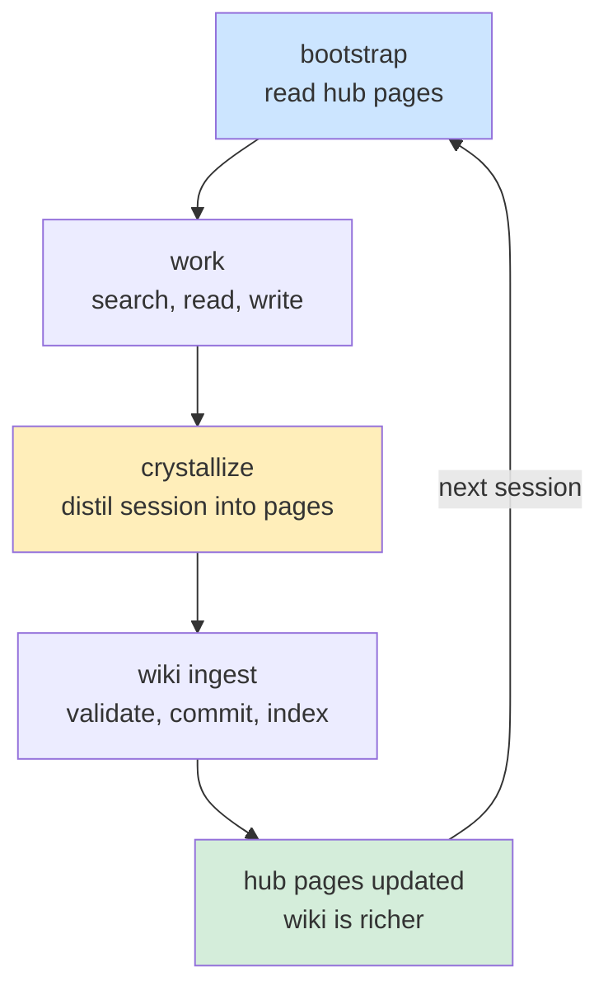
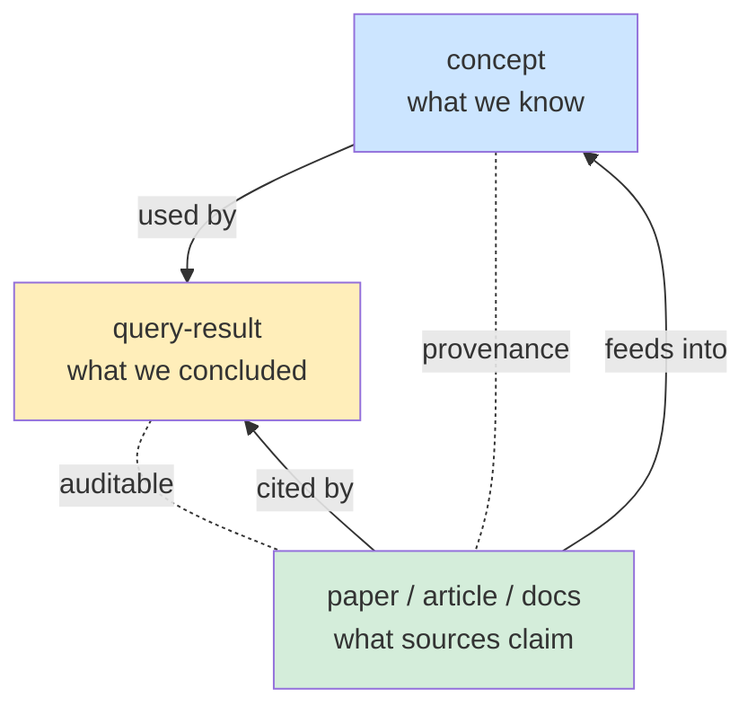
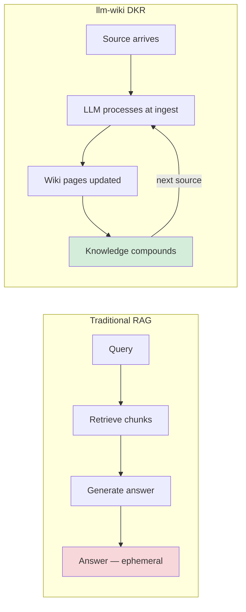

# Diagrams

Mermaid sources for all llm-wiki diagrams. Intended for inline use in the
README and specification documents.

---

## 1. Architecture Overview

How the engine sits between humans, LLMs, and the wiki repository.

→ [Overview](specifications/overview.md) · [Serve](specifications/commands/serve.md)

---

## 2. Repository Layers

The four-layer structure of a wiki repository.

→ [Repository layout](specifications/core/repository-layout.md)

---

## 3. Ingest Pipeline

How content enters the wiki — from source to committed knowledge.

→ [Ingest](specifications/pipelines/ingest.md)

---

## 4. LLM Ingest Workflow

The full LLM-driven ingest loop via MCP tools.

→ [Ingest](specifications/pipelines/ingest.md) · [MCP clients](specifications/integrations/mcp-clients.md)

---

## 5. Bootstrap / Crystallize Loop

The compounding loop across sessions — each session starts richer than the last.

→ [Session bootstrap](specifications/llm/session-bootstrap.md) · [Crystallize](specifications/pipelines/crystallize.md)

---

## 6. Epistemic Model

The three epistemic roles and how they relate.

→ [Epistemic model](specifications/core/epistemic-model.md) · [Source classification](specifications/core/source-classification.md)

---

## 7. RAG vs DKR

Side-by-side comparison of the two approaches.

→ [Overview](specifications/overview.md)

