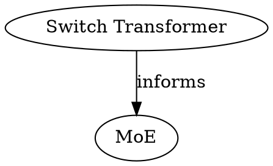

# Graph Builder Implementation

Implementation reference for the concept graph. Not a specification —
see [graph.md](../specifications/engine/graph.md) for the design.

## Current vs New Approach

The current implementation walks the filesystem, reads every `.md` file,
parses frontmatter, and extracts links. This is O(n) file reads on
every `wiki_graph` call.

The new approach builds the graph from the tantivy index — no file
reads. Edge fields (`sources`, `concepts`, `superseded_by`,
`document_refs`) are already indexed as keyword slugs. Body
`[[wiki-links]]` need to be extracted at ingest time and stored in the
index.

## Types

```rust
struct PageNode {
    slug: String,
    title: String,
    page_type: String,
}

struct LabeledEdge {
    relation: String,    // fed-by, depends-on, cites, links-to, etc.
}

type WikiGraph = DiGraph<PageNode, LabeledEdge>;
```

The current code uses `DiGraph<PageNode, ()>` — untyped edges. The new
code uses `LabeledEdge` with a relation string from `x-graph-edges`.

## Build Process

```
1. Read all documents from tantivy index
   - For each: slug, title, type, and all keyword slug-list fields
2. Create a node per document
3. For each document:
   a. Look up its type in the SpaceTypeRegistry
   b. Read x-graph-edges declarations for that type
   c. For each edge field (sources, concepts, etc.):
      - Get the slug list from the index
      - Get the relation label from x-graph-edges
      - Create a LabeledEdge to each target slug
   d. For body [[wiki-links]] (stored in index at ingest time):
      - Create a LabeledEdge with relation "links-to"
4. Build petgraph
```

No file I/O — everything comes from the tantivy index and the type
registry.

## Wiki-Links at Ingest Time

Body `[[wiki-links]]` must be extracted during ingest and stored in the
index, so the graph builder doesn't need to read files.

Existing crates (`trama`, `nexis`, `turbovault-parser`) are
Obsidian-specific and heavier than needed. Our `[[slug]]` syntax is
simpler — the current `extract_wikilinks` (15 lines) handles it. Keep
our own.

At ingest:
1. Parse body text
2. Extract `[[slug]]` patterns (existing `extract_wikilinks` logic)
3. Store as a keyword slug-list field in the index (e.g. `body_links`)

The graph builder reads `body_links` from the index like any other
edge field, with a hardcoded `links-to` relation.

## Filtering

Applied after graph construction:

| Filter               | How                                              |
| -------------------- | ------------------------------------------------ |
| `--type`             | Include only nodes matching the type(s)          |
| `--relation`         | Include only edges matching the relation         |
| `--root` + `--depth` | BFS from root node, keep nodes within depth hops |

Filters compose — apply type filter first, then relation filter, then
root/depth subgraph extraction.

## Subgraph Extraction

BFS from root node, following both outgoing and incoming edges, up to
the depth limit. The current `subgraph()` function handles this
correctly — reusable as-is, just needs to carry `LabeledEdge` instead
of `()`.

## Rendering

### Mermaid

```
graph LR
  concepts/moe["MoE"]:::concept
  sources/switch["Switch Transformer"]:::paper

  sources/switch -->|informs| concepts/moe

  classDef concept fill:#cce5ff
  classDef paper fill:#d4edda
```

Nodes include title as label and type as CSS class. Edges include
relation as label.

### DOT



### Markdown wrapper

When `--output` writes a `.md` file, wrap with frontmatter
(`status: generated`). The current `wrap_graph_md` is reusable.

## Existing Code

| Component                      | Reusable | Notes                                         |
| ------------------------------ | -------- | --------------------------------------------- |
| `PageNode`                     | yes      | Add it's already there                        |
| `GraphFilter`                  | yes      | Add `relation` field                          |
| `GraphReport`                  | yes      | As-is                                         |
| `build_graph`                  | rewrite  | Replace file-walking with index reads         |
| `render_mermaid`               | rewrite  | Add relation labels, node titles, CSS classes |
| `render_dot`                   | rewrite  | Add relation labels, node attributes          |
| `wrap_graph_md`                | yes      | As-is                                         |
| `subgraph`                     | mostly   | Change edge type from `()` to `LabeledEdge`   |
| `in_degree`                    | yes      | As-is                                         |
| `extract_links` (links.rs)     | move     | Extract at ingest time, store in index        |
| `extract_wikilinks` (links.rs) | keep     | Used at ingest time for body link extraction  |

### Key change

The graph builder no longer reads files. It reads the tantivy index
(fast) and the type registry (in-memory). File reading happens once at
ingest time. This makes `wiki_graph` fast regardless of wiki size.
